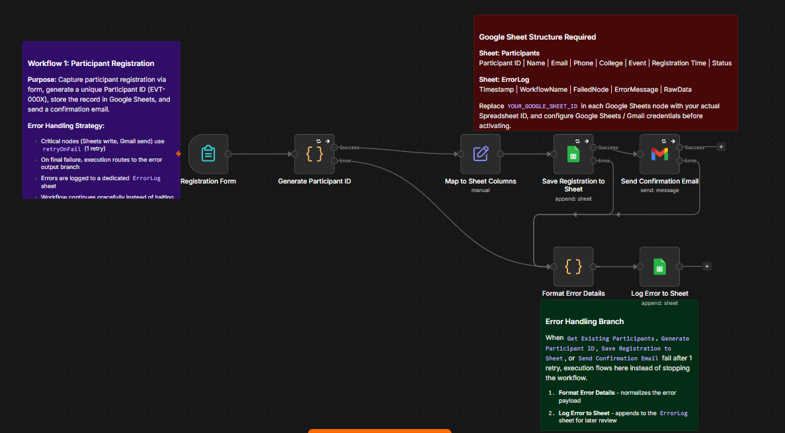
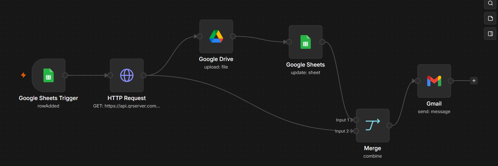
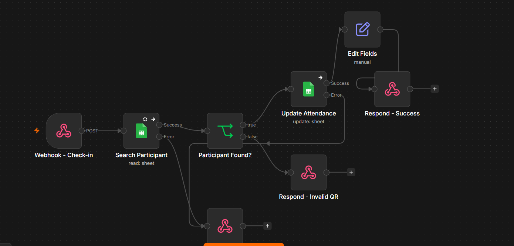
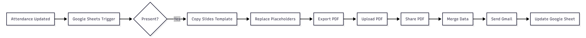
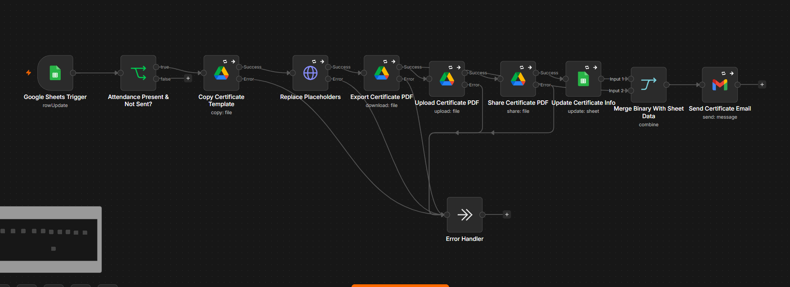
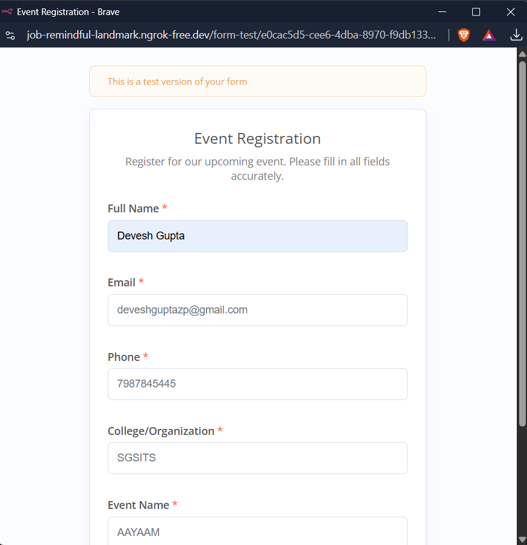
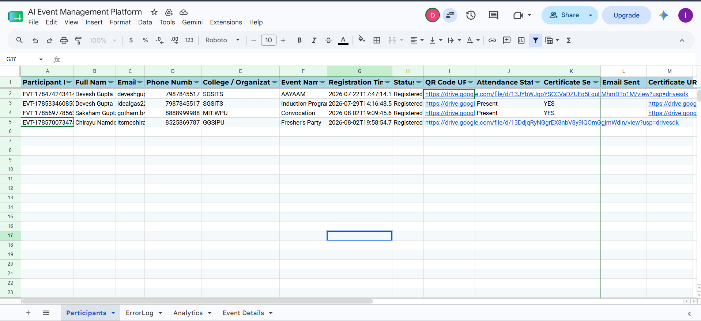
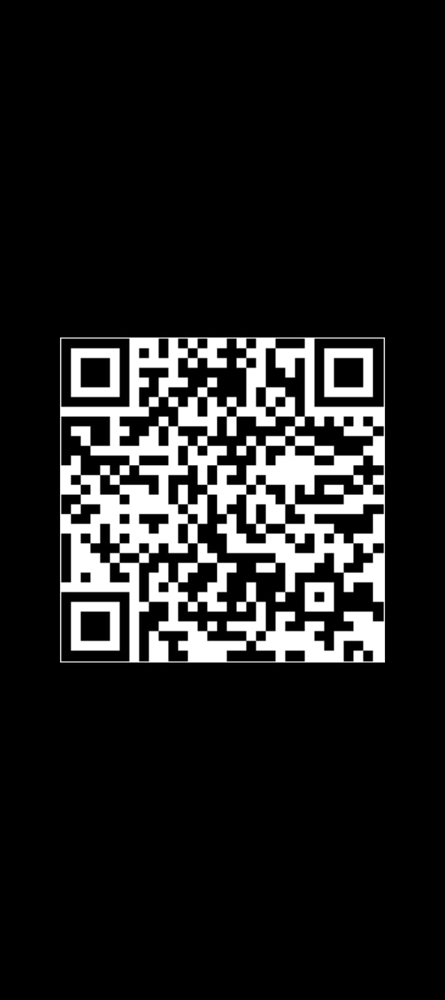
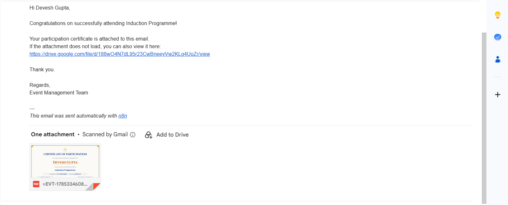

# 🎓 Smart Event Management Automation

An end-to-end event management and certificate distribution system built using **n8n** and **Google Workspace**. The project automates participant registration, QR code generation, attendance tracking, personalized certificate creation, PDF generation, cloud storage, and email delivery.

---

## 📌 Features

- 📝 Participant Registration Automation
- 🔳 Automatic QR Code Generation
- ✅ Attendance Verification
- 📄 Personalized Certificate Generation
- 📑 PDF Export using Google Slides
- ☁️ Google Drive Upload & Sharing
- 📧 Automated Email Delivery
- 📊 Google Sheets Database Integration
- ⚠️ Error Handling & Logging

---

## 🏗️ System Architecture


---

## 🔄 Workflow Interaction


---

## ⚡ Event Flow


---

# 🛠️ Workflows

## Workflow 1 — Participant Registration

Automates participant registration by generating a unique Participant ID and storing participant details in Google Sheets.

**Screenshot**



---

## Workflow 2 — QR Code Generation

Generates a unique QR code for every participant and stores it for attendance verification.

**Screenshot**



---

## Workflow 3 — Attendance Tracking

Marks participant attendance after QR code verification and updates the attendance database.

**Screenshot**



---

## Workflow 4 — Certificate Distribution

Automatically:

- Copies the certificate template
- Replaces placeholders
- Generates PDF
- Uploads to Google Drive
- Creates a shareable link
- Updates Google Sheets
- Sends the certificate via Gmail

**Architecture**



**Workflow**



---

# 📷 Project Screenshots

## Registration Form



---

## Registration Database



---

## QR Code



---

## Generated Certificate

The repository includes a sample generated certificate.

📄 **certificate.pdf**

---

## Certificate Email



---

# 📂 Repository Structure

```text
.
├── docs/
├── screenshots/
├── workflows/
├── README.md
├── LICENSE
└── .gitignore
```

---

# 🚀 Technologies Used

- n8n
- Google Sheets API
- Google Drive API
- Google Slides API
- Gmail API
- Google Forms
- QR Code Generation
- JavaScript

---

# 📁 Workflows

| Workflow | Description |
|-----------|-------------|
| Workflow 1 | Participant Registration |
| Workflow 2 | QR Code Generation |
| Workflow 3 | Attendance Tracking |
| Workflow 4 | Certificate Distribution |

---

# 📄 License

This project is licensed under the MIT License.