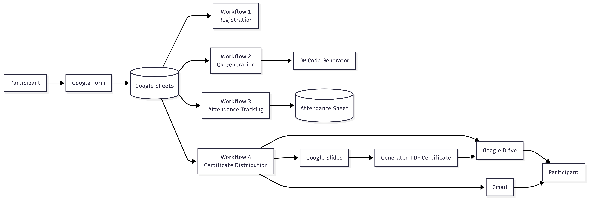
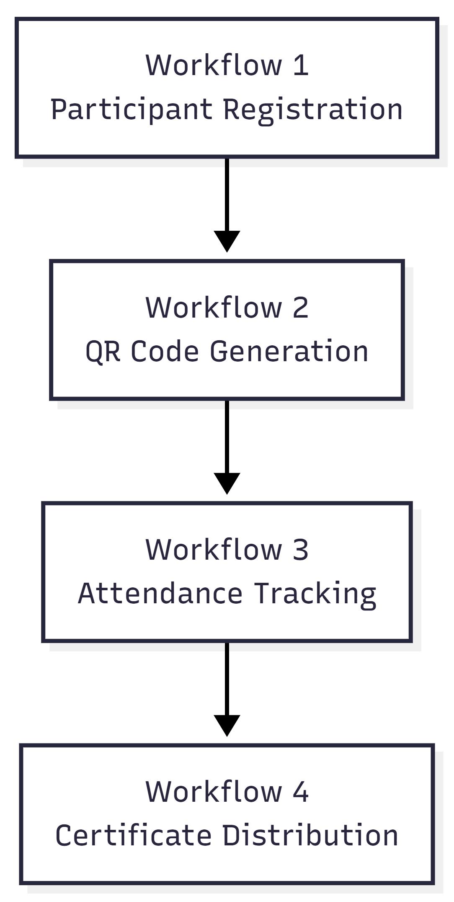

# Workflow Architecture

## Overview

The Smart Event Management Automation System is built using four independent n8n workflows that communicate through Google Sheets and Google Workspace services. Each workflow is responsible for a specific stage of the event lifecycle while maintaining a modular and scalable architecture.

---

# Overall System Architecture

The architecture integrates Google Forms, Google Sheets, Google Slides, Google Drive, Gmail, and n8n to automate participant registration, attendance tracking, certificate generation, and certificate distribution.

---

# Workflow Interaction

Each workflow operates independently while passing information to the next workflow through Google Sheets.

- Workflow 1 registers participants.
- Workflow 2 generates participant-specific QR codes.
- Workflow 3 tracks attendance using participant information.
- Workflow 4 generates and distributes certificates based on attendance.

This modular design simplifies maintenance and allows each workflow to be updated independently.

---

# Individual Workflows

## Workflow 1 – Participant Registration

**Purpose**

Registers participants and stores their information in Google Sheets.

**Key Functions**

- Collect participant information
- Generate Participant ID
- Store registration data
- Trigger downstream workflows

---

## Workflow 2 – QR Code Generation

**Purpose**

Generates unique QR codes for registered participants.

**Key Functions**

- Generate QR code
- Associate QR with Participant ID
- Store QR information
- Send QR code to participants

---

## Workflow 3 – Attendance Tracking

**Purpose**

Records participant attendance during the event.

**Key Functions**

- Verify participant identity
- Update attendance status
- Prevent duplicate attendance
- Trigger certificate generation

---

## Workflow 4 – Certificate Distribution

**Purpose**

Automatically generates and distributes participation certificates.

**Key Functions**

- Copy Google Slides template
- Replace participant details
- Export certificate as PDF
- Upload certificate to Google Drive
- Share certificate
- Email certificate to participant
- Update delivery status

---

# Design Principles

The workflow architecture follows a modular approach with the following characteristics:

- Independent workflows
- Event-driven execution
- Centralized data storage using Google Sheets
- Cloud-based document management
- Automated email communication
- Error handling and retry mechanisms

This architecture improves scalability, simplifies debugging, and allows future enhancements without affecting existing workflows.