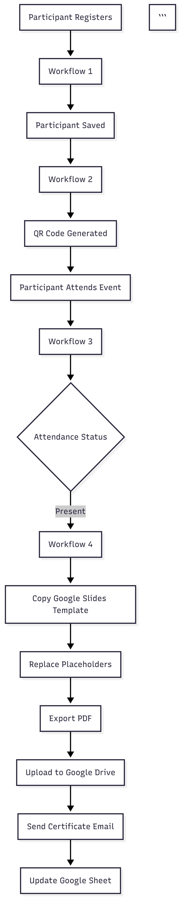

# Event Flow

## Overview

The Smart Event Management Automation System follows an event-driven architecture where each workflow is triggered by the successful completion of the previous workflow. This enables a seamless automation pipeline from participant registration to certificate delivery.

---

# Event Flow Diagram



---

## Step 1 – Participant Registration

The process begins when a participant submits the registration form.

**Trigger**

- Google Form Submission

**Actions**

- Validate participant information.
- Generate a unique Participant ID.
- Store participant details in Google Sheets.

**Output**

- Registered participant record.

---

## Step 2 – QR Code Generation

A new registration automatically triggers the QR Code Generation workflow.

**Actions**

- Generate a unique QR code.
- Associate the QR code with the Participant ID.
- Store the QR code reference.
- Email the QR code to the participant.

**Output**

- Participant receives QR code.

---

## Step 3 – Attendance Tracking

During the event, participant attendance is recorded using the generated QR code.

**Trigger**

- Attendance update

**Actions**

- Verify Participant ID.
- Update attendance status.
- Record attendance timestamp.
- Prevent duplicate attendance entries.

**Output**

- Attendance marked as **Present**.

---

## Step 4 – Certificate Distribution

Once attendance is confirmed, the certificate distribution workflow is automatically triggered.

**Actions**

- Copy the Google Slides certificate template.
- Replace placeholders with participant information.
- Export the certificate as a PDF.
- Upload the PDF to Google Drive.
- Generate a shareable link.
- Email the certificate to the participant.
- Update the Google Sheet to indicate successful certificate delivery.

**Output**

- Participant receives the certificate via email.

---

# Event Sequence

```text
Participant Registration
        │
        ▼
Workflow 1
        │
        ▼
Participant Stored
        │
        ▼
Workflow 2
        │
        ▼
QR Code Generated
        │
        ▼
Participant Attends Event
        │
        ▼
Workflow 3
        │
        ▼
Attendance Updated
        │
        ▼
Workflow 4
        │
        ▼
Certificate Generated
        │
        ▼
PDF Exported
        │
        ▼
Google Drive Upload
        │
        ▼
Certificate Email Sent
        │
        ▼
Google Sheet Updated
```

---

## Benefits of the Event-Driven Design

- Independent workflows that can be maintained separately.
- Automatic execution without manual intervention.
- Real-time data synchronization through Google Sheets.
- Improved scalability for handling multiple participants.
- Reduced manual effort and faster certificate distribution.